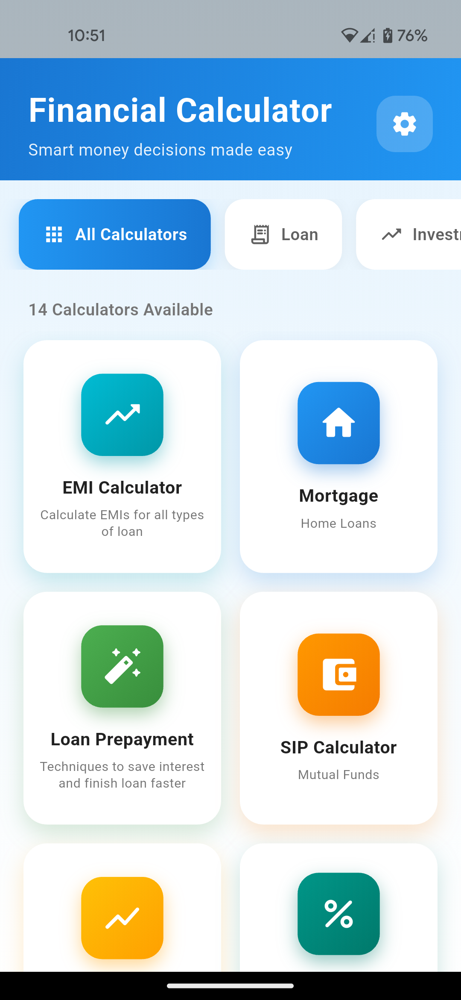
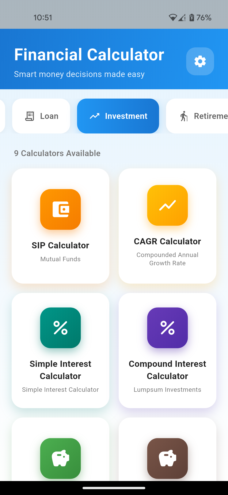
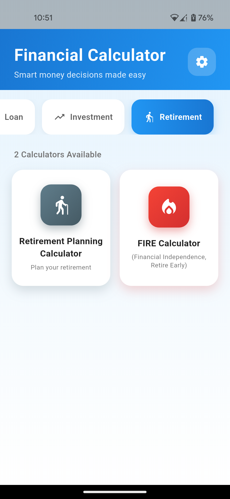

# WeFin Calculator - Your All-in-One Financial Calculator

WeFin Calculator is a comprehensive Flutter-based financial calculator application designed to help users manage their finances effectively. It provides various calculators for investments, loans, and retirement planning, all within a user-friendly interface.

## Table of Contents

- [Features](#features)
- [Recent Features](#recent-features)
- [Screenshots](#screenshots)
- [Installation](#installation)
- [Usage](#usage)
- [Project Structure](#project-structure)
- [Contributing](#contributing)
- [License](#license)
- [To-Do](#to-do)
- [Privacy Policy](#privacy-policy)

## Features

- **Investment Calculator**: Plan your investments with detailed calculations for returns, compound interest, and more.
- **Loan Calculator**: Understand your loan repayments, interest, and amortization schedules.
- **Retirement Calculator**: Estimate your retirement savings and plan for a secure future.
- **User-Friendly Interface**: Clean and intuitive design for easy navigation and input.
- **Cross-Platform**: Built with Flutter, supporting Android, iOS, Web, Windows, macOS, and Linux.
- **Financial Health Score**: Per-user score computed from profile data (income, savings, debt, emergency fund) and calculator usage. Implemented in `lib/services/financial_health_service.dart` and surfaced in multiple calculators.
- **Referral & Rewards**: Local referral code generation, sharing, and milestone rewards. See `lib/services/referral_service.dart` and `lib/widgets/referral_rewards_card.dart`.
- **Usage Tracking (`UserDataService`)**: Tracks per-calculator usage counts and persists them via `SharedPreferences`. See `lib/services/user_data_service.dart`.
- **Achievement Badges**: Badge UI and achievements integrated with `AchievementService` (`lib/widgets/achievement_badge.dart`).
- **Calculator Integrations**: SIP, EMI, Loan Prepayment, Home Loan, and FIRE calculators now integrate Financial Health context and usage tracking.
- **Layout & Lint Fixes**: Resolved Row overflows and unbounded-height GridView crashes; replaced deprecated `Switch.activeColor` uses; addressed null-safety and analyzer warnings.
- **Unit Tests**: Added/updated tests for financial health logic to ensure correctness.
- **Documentation Consolidation**: Project docs consolidated and `README.md` rewritten to reflect current state.

## Screenshots

<!-- Add screenshots of your application here. Example: -->

| Home Screen | Investment Calculator | Loan Calculator | Retirement Calculator |
|-------------|-----------------------|-----------------|-----------------------|
|  |  |  |  |

## Installation

To get a local copy up and running, follow these simple steps.

### Prerequisites

Make sure you have Flutter installed. If not, follow the official Flutter installation guide: [Flutter Get Started](https://flutter.dev/docs/get-started/install)

### Steps

1.  **Clone the repository:**
    ```bash
    git clone https://github.com/Jugal211/weqacalc.git
    cd weqacalc
    ```
2.  **Get dependencies:**
    ```bash
    flutter pub get
    ```
3.  **Run the application:**
    ```bash
    flutter run
    ```

## Usage

-   Navigate through the different calculator sections using the bottom navigation bar or the app drawer.
-   Enter your financial details into the respective fields.
-   View instant calculations and results.

## Project Structure

```
.
├── android/                  # Android project and Gradle scripts
├── ios/                      # iOS project files
├── macos/                    # macOS host files
├── windows/                  # Windows host files
├── web/                      # Web entry and assets
├── lib/                      # Flutter app source
│   ├── main.dart             # App bootstrap and providers
│   ├── models/               # DTOs and data models
│   ├── services/             # Core services (user_data, referral, financial health, achievements)
│   │   ├── user_data_service.dart
│   │   ├── referral_service.dart
│   │   ├── financial_health_service.dart
│   │   └── achievement_service.dart
│   ├── screens/              # App screens and calculator modules
│   │   ├── financial_calc_home.dart
│   │   ├── investment_calculator/
│   │   ├── loan_calculator/
│   │   └── retirement_calculator/
│   ├── widgets/              # Reusable widgets and UI components
│   └── utils/                # Helpers and small UI builders (calculator_card, calculator_grid)
├── assets/                   # Images, icons, and other assets
├── test/                     # Unit and widget tests
├── pubspec.yaml              # Project metadata & dependencies
├── README.md                 # Project documentation
├── privacy-policy.html       # Privacy policy
└── LICENSE                   # License file
```

## Contributing

Contributions are what make the open-source community such an amazing place to learn, inspire, and create. Any contributions you make are **greatly appreciated**.

If you have a suggestion that would make this better, please fork the repo and create a pull request. You can also simply open an issue with the tag "enhancement".
Don't forget to give the project a star! Thanks again!

1.  Fork the Project
2.  Create your Feature Branch (`git checkout -b feature/AmazingFeature`)
3.  Commit your Changes (`git commit -m 'Add some AmazingFeature'`)
4.  Push to the Branch (`git push origin feature/AmazingFeature`)
5.  Open a Pull Request

## License

Distributed under the MIT License. See `LICENSE` for more information.

## To-Do

- [ ] Add more financial calculators (e.g., mortgage, savings)
- [ ] Implement user accounts to save calculations
- [ ] Add charts and graphs for better visualization
- [ ] Improve UI/UX and add animations
- [ ] Add localization for multiple languages

## Privacy Policy

We are committed to protecting your privacy. Please read our [Privacy Policy](privacy-policy.html) to understand how we handle your data.

---

Project Link: [https://github.com/Jugal211/weqacalc](https://github.com/Jugal211/weqacalc)

---